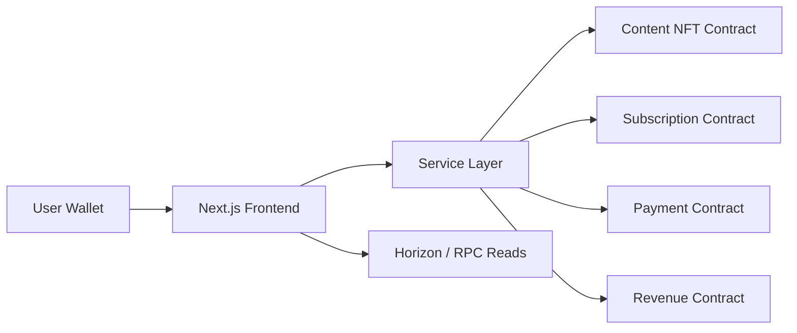

# StellarClips

Decentralized creator monetization on Stellar + Soroban.

StellarClips lets creators publish tokenized content and earn through:
- pay-per-content purchases,
- recurring subscriptions,
- direct tips,
- on-chain revenue accounting and withdrawals.

The app frontend is built with Next.js and all core monetization actions are wired to Soroban smart contracts.

---

## Product Overview

StellarClips is a Web3 content platform where users connect a Stellar wallet, discover premium creator content, and pay directly on-chain.

### Core user flows
- **Creators** publish content, set pricing, create subscription tiers, and withdraw earnings.
- **Users** browse content, unlock paid posts, subscribe to creators, and send tips.
- **Platform** tracks business logic on-chain through dedicated Soroban contracts.

### Key features
- Pay-per-content unlocks
- Tiered subscriptions
- Creator tipping
- Revenue and withdrawal tracking
- Wallet-based authentication and signing
- Testnet/mainnet network switching via environment config

---

## Tech Stack

- **Frontend:** Next.js 16, React 19, TypeScript, Tailwind CSS, shadcn/ui
- **Blockchain:** Stellar + Soroban smart contracts (Rust)
- **SDK:** `@stellar/stellar-sdk`
- **Wallet integration:** Stellar Wallets Kit + Albedo intent
- **Hosting:** Vercel

---

## Architecture



### Architecture notes
- UI components call service modules in `lib/services`.
- Service modules convert values (e.g. XLM ↔ stroops), then invoke Soroban methods.
- Contract writes are signed from user wallets.
- Read views (history/profile/dashboard) use RPC + Horizon/indexer style reads.

---

## Smart Contracts

All smart contracts live in [contracts](contracts) and are written in Rust.

| Contract | Purpose | Source Link |
|---|---|---|
| Content NFT | Content creation, metadata, pricing, ownership records | [contracts/content_nft/src/lib.rs](contracts/content_nft/src/lib.rs) |
| Subscription | Tier creation, subscribe/cancel/renew, subscription checks | [contracts/subscription/src/lib.rs](contracts/subscription/src/lib.rs) |
| Payment | Pay-for-content and tipping flows | [contracts/payment/src/lib.rs](contracts/payment/src/lib.rs) |
| Revenue | Creator balance accounting and withdrawals | [contracts/revenue/src/lib.rs](contracts/revenue/src/lib.rs) |

### Contract deployment scripts
- [contracts/build.sh](contracts/build.sh)
- [contracts/deploy.sh](contracts/deploy.sh)
- [contracts/deploy-testnet.sh](contracts/deploy-testnet.sh)
- [contracts/deploy-via-rpc.sh](contracts/deploy-via-rpc.sh)
- [contracts/deploy-with-nodejs.js](contracts/deploy-with-nodejs.js)

### Contract docs
- [contracts/README.md](contracts/README.md)
- [DEPLOY_TO_TESTNET.md](DEPLOY_TO_TESTNET.md)

---

## Smart Contract Deployment Links

Use these direct links for deployment references:

- Main deployment guide: [docs/DEPLOYMENT.md](docs/DEPLOYMENT.md)
- Testnet quick deployment: [DEPLOY_TO_TESTNET.md](DEPLOY_TO_TESTNET.md)
- Contract deployment scripts folder: [contracts](contracts)
- Build script: [contracts/build.sh](contracts/build.sh)
- Standard deploy script: [contracts/deploy.sh](contracts/deploy.sh)
- Testnet deploy script: [contracts/deploy-testnet.sh](contracts/deploy-testnet.sh)
- RPC deploy script: [contracts/deploy-via-rpc.sh](contracts/deploy-via-rpc.sh)
- Node.js deploy script: [contracts/deploy-with-nodejs.js](contracts/deploy-with-nodejs.js)

---

## Contract Address Links (Explorer)

Deployed testnet contract links:

- Content NFT: [https://stellar.expert/explorer/testnet/contract/CC7SN7PTB6QGLMJ4KLMZMJB7IM4VESDFYQKSZ4XBGQS562GT7XJLCE45](https://stellar.expert/explorer/testnet/contract/CC7SN7PTB6QGLMJ4KLMZMJB7IM4VESDFYQKSZ4XBGQS562GT7XJLCE45)
- Subscription: [https://stellar.expert/explorer/testnet/contract/CA3RHIGE5HCJ5PJVITWB3JB6K6AA37UOAANBD34XZ2UD2G4UZWRIIORX](https://stellar.expert/explorer/testnet/contract/CA3RHIGE5HCJ5PJVITWB3JB6K6AA37UOAANBD34XZ2UD2G4UZWRIIORX)
- Payment: [https://stellar.expert/explorer/testnet/contract/CCLTUXJLTZXIXPCMUZKSA5FWMOHKJ2T3FZLLMJAXBD5A6XQ27QSID4G7](https://stellar.expert/explorer/testnet/contract/CCLTUXJLTZXIXPCMUZKSA5FWMOHKJ2T3FZLLMJAXBD5A6XQ27QSID4G7)
- Revenue: [https://stellar.expert/explorer/testnet/contract/CDCWH7TPIQMZUROU47AMXK7XZJUIB4FZUQWRNDN4YXCCNC6G2QAAMH5R](https://stellar.expert/explorer/testnet/contract/CDCWH7TPIQMZUROU47AMXK7XZJUIB4FZUQWRNDN4YXCCNC6G2QAAMH5R)

## Transaction Check Links

Use these links to verify successful transactions from wallet popups, logs, or script output:

- Transaction by hash (testnet): [https://stellar.expert/explorer/testnet/tx/<TX_HASH>](https://stellar.expert/explorer/testnet/tx/%3CTX_HASH%3E)
- Account operation history (testnet): [https://stellar.expert/explorer/testnet/account/<PUBLIC_KEY>](https://stellar.expert/explorer/testnet/account/%3CPUBLIC_KEY%3E)
- Contract page by ID (testnet): [https://stellar.expert/explorer/testnet/contract/<CONTRACT_ID>](https://stellar.expert/explorer/testnet/contract/%3CCONTRACT_ID%3E)

### Deployment Transactions (Verified)

- Content NFT deploy tx: [https://stellar.expert/explorer/testnet/tx/a30675c589692c47487f9053415e217eeee6206fb9535f1892d519da237812b6](https://stellar.expert/explorer/testnet/tx/a30675c589692c47487f9053415e217eeee6206fb9535f1892d519da237812b6)
- Subscription deploy tx: [https://stellar.expert/explorer/testnet/tx/75bb66ae1b351d524dea448ff149e3c3697d24e187e41fbd7320f6f25bd21fdb](https://stellar.expert/explorer/testnet/tx/75bb66ae1b351d524dea448ff149e3c3697d24e187e41fbd7320f6f25bd21fdb)
- Payment deploy tx: [https://stellar.expert/explorer/testnet/tx/0f6d2cbc44f46a598d5bb95adee6c8f02a08b69cf479b244a4e636c771ae4da5](https://stellar.expert/explorer/testnet/tx/0f6d2cbc44f46a598d5bb95adee6c8f02a08b69cf479b244a4e636c771ae4da5)
- Revenue deploy tx: [https://stellar.expert/explorer/testnet/tx/89672ec141edca2ea8f456ddf14aa115f476c6109938d5e757963185edea7d27](https://stellar.expert/explorer/testnet/tx/89672ec141edca2ea8f456ddf14aa115f476c6109938d5e757963185edea7d27)

For mainnet, replace `testnet` with `public`.

---

## Environment Variables

Create `.env.local` in the project root:

```env
NEXT_PUBLIC_STELLAR_NETWORK=testnet
NEXT_PUBLIC_STELLAR_RPC_URL=https://soroban-testnet.stellar.org
NEXT_PUBLIC_HORIZON_URL=https://horizon-testnet.stellar.org

NEXT_PUBLIC_CONTENT_NFT_CONTRACT=<DEPLOYED_CONTRACT_ID>
NEXT_PUBLIC_SUBSCRIPTION_CONTRACT=<DEPLOYED_CONTRACT_ID>
NEXT_PUBLIC_PAYMENT_CONTRACT=<DEPLOYED_CONTRACT_ID>
NEXT_PUBLIC_REVENUE_CONTRACT=<DEPLOYED_CONTRACT_ID>

# Optional legacy/config keys used in config modules
NEXT_PUBLIC_TIP_CONTRACT_ID=<OPTIONAL_CONTRACT_ID>
NEXT_PUBLIC_SUBSCRIPTION_CONTRACT_ID=<OPTIONAL_CONTRACT_ID>
```

---

## Local Development

### Prerequisites
- Node.js 20+
- pnpm
- Rust + Cargo
- Soroban CLI

### 1) Install app deps
```bash
pnpm install
```

### 2) Run frontend
```bash
pnpm dev
```

### 3) Production build test
```bash
pnpm build
```

---

## Smart Contract Build & Deploy

Run from repository root.

### 1) Build contracts
```bash
cd contracts
./build.sh
```

### 2) Deploy contracts
```bash
./deploy.sh testnet
```

Alternative scripts:
- `./deploy-testnet.sh`
- `./deploy-via-rpc.sh`
- `node ./deploy-with-nodejs.js testnet <SECRET_KEY>`

### 3) Update `.env.local`
Copy deployed contract IDs into the env vars, then restart `pnpm dev`.

---

## Deploy to Vercel

### Quick steps
1. Push repository to GitHub.
2. Import project in Vercel.
3. Set environment variables from `.env.local`.
4. Deploy.

### Recommended Vercel settings
- Framework preset: **Next.js**
- Install command: `pnpm install`
- Build command: `pnpm build`
- Output command: (default)

Detailed guide: [docs/DEPLOYMENT.md](docs/DEPLOYMENT.md)

---

## Repository Structure

```text
app/                    Next.js App Router pages + API routes
components/             UI and feature components
lib/services/           On-chain service layer (content/payment/subscription/revenue)
lib/stellar/            Soroban + wallet client integrations
contracts/              Soroban Rust contracts + deployment scripts
docs/                   Deployment and API docs
```

---

## Security Notes

- Wallet signatures required for state-changing transactions
- On-chain logic is contract-enforced
- Do not commit secret keys or private env files
- Use testnet for validation before mainnet deployment

---

## Useful Links

- Stellar docs: https://developers.stellar.org
- Soroban docs: https://developers.stellar.org/docs/build/smart-contracts
- Testnet friendbot: https://stellar.expert/testnet/friendbot
- Vercel docs: https://vercel.com/docs

---

## Thanks

Thank you for checking out StellarClips.

Big thanks to:
- Stellar & Soroban ecosystem contributors,
- wallet tooling maintainers,
- open-source UI and framework communities,
- and every creator building on-chain products.

If this project helps you, please star the repository and share feedback.

---

## License

This project is licensed under MIT. See [LICENSE](LICENSE).
